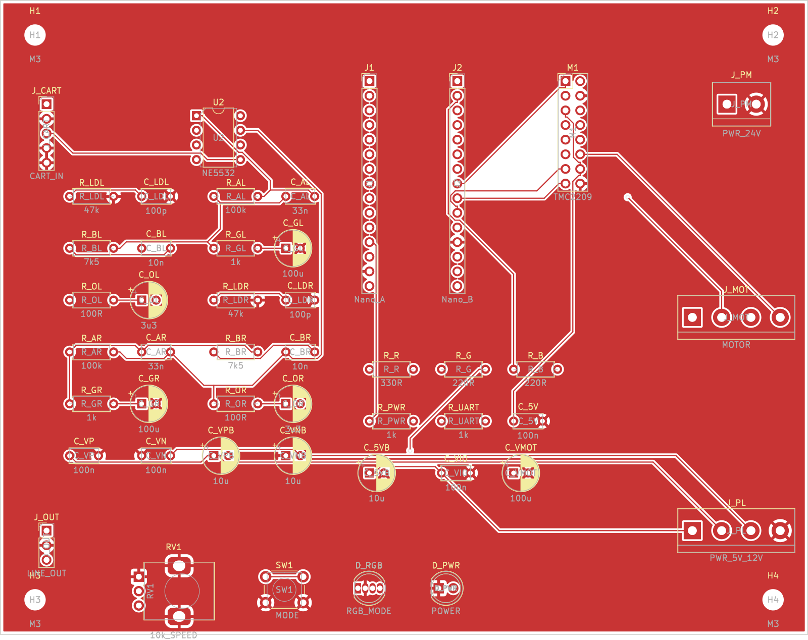

# Player mainboard (KiCad)

A single fabricable 2-layer PCB that carries the whole player turntable
electronics: the **Arduino Nano**, a **TMC2209** stepper-driver module, the
**RIAA phono preamp**, and all **front-panel I/O**. Speed is open-loop
feedforward (see [`docs/CALIBRATION.md`](../../docs/CALIBRATION.md)); the board
has no speed sensor.



Open in KiCad 7+: `krrl_player.kicad_pro` (board `krrl_player.kicad_pcb`). It is a
**standalone board** (no schematic sheet) — every connection is defined by the
board nets, tabulated below and in [`NETLIST.txt`](NETLIST.txt).

## Board sections

- **Left:** analog phono — cartridge input `J_CART`, `NE5532` (`U2`), the RIAA
  network, and line output `J_OUT`.
- **Centre/right:** digital — the Nano (`J1`/`J2`) and the TMC2209 module (`M1`).
- **Right edge:** power/motor terminals (`J_PM`, `J_PL`, `J_MOT`).
- **Front edge:** controls — mode button `SW1`, speed pot `RV1`, RGB mode LED
  `D_RGB`, power LED `D_PWR`.

The analog section sits at the opposite end from the motor terminal and TMC to
keep the 5 mV cartridge signal away from stepper switching (see
[`hardware/phono.md`](../phono.md) for the EMI/grounding rationale).

## Power supply (external, separate — specify when ordering the PSU)

The board has **no on-board regulators**; it expects an external multi-rail
supply. A linear analog rail keeps the phono stage quiet.

| Rail | Use | Min current | Enters at |
|------|-----|-------------|-----------|
| +24 V | Stepper (TMC `VMOT`) | ~1.5 A | `J_PM` pin 1 |
| +5 V | Logic (Nano, TMC `VIO`, LEDs) | ~0.5 A | `J_PL` pin 1 |
| +12 V | Phono op-amp V+ | ~50 mA | `J_PL` pin 2 |
| −12 V | Phono op-amp V− | ~50 mA | `J_PL` pin 3 |
| GND | Common return | — | `J_PM` pin 2, `J_PL` pin 4 |

All grounds meet at the board (single GND pour = star point). Keep the PSU's
motor return and analog return joined only at the supply to avoid a ground loop.
±12 V may be ±15 V if preferred (NE5532 max ±22 V).

## Connectors

**`J_PM` — 24 V motor power** (2-pos): 1 = +24 V, 2 = GND.
**`J_PL` — logic/analog power** (4-pos): 1 = +5 V, 2 = +12 V, 3 = −12 V, 4 = GND.
**`J_MOT` — stepper motor** (4-pos): 1 = 2B, 2 = 2A, 3 = 1A, 4 = 1B (coil pairs
1A/1B and 2A/2B).
**`J_CART` — cartridge in** (1×5): 1 = L-hot, 2 = L-gnd, 3 = R-hot, 4 = R-gnd,
5 = shield (2/4/5 → GND).
**`J_OUT` — line out** (1×3): 1 = L, 2 = GND, 3 = R (fit an RCA pigtail).

## Front panel

| Control | Part | Wiring |
|---------|------|--------|
| Mode button | `SW1` momentary | to `MODE` (Nano D6, `INPUT_PULLUP`) and GND |
| Speed pot | `RV1` 10k lin | 1 → GND, 2 (wiper) → A0, 3 → +5 V |
| Mode LED | `D_RGB` common-cathode | R/G/B anodes via `R_R`/`R_G`/`R_B` → D9/D10/D11; cathode → GND |
| Power LED | `D_PWR` | +5 V → `R_PWR` → anode; cathode → GND |

RGB colours (firmware): off = stopped, green = 33, blue = 45, red = 78; blinks
while spinning up, solid at speed.

## Nano pin usage (`J1` side A, `J2` side B)

| Net | Nano pin | Header |
|-----|----------|--------|
| +5 V | 5V | J1.12 |
| GND | GND | J1.14, J2.12 |
| Speed pot wiper | A0 | J1.4 |
| STEP | D3 | J2.10 |
| DIR | D4 | J2.9 |
| EN | D5 | J2.8 |
| MODE | D6 | J2.7 |
| LED R / G / B | D9 / D10 / D11 | J2.4 / J2.3 / J2.2 |
| TMC UART (opt.) | D1 TX / D0 RX | J2.15 / J2.14 |

## TMC2209 module header (`M1`, 2×8)

Follows the StepStick / A4988-compatible layout so a SilentStepStick-class
TMC2209 mounts here. **Verify your module's pinout — especially the PDN/UART
pin — before soldering.**

| Pin | Net | Pin | Net |
|----:|-----|----:|-----|
| 1 | EN | 2 | +24 V (VMOT) |
| 3 | MS1 → +5 V | 4 | GND |
| 5 | MS2 → +5 V | 6 | 2B |
| 7 | PDN/UART | 8 | 2A |
| 9 | (nc) | 10 | 1A |
| 11 | (nc) | 12 | 1B |
| 13 | STEP | 14 | +5 V (VIO) |
| 15 | DIR | 16 | GND |

`MS1`/`MS2` are tied to +5 V for **1/16 microstepping** in standalone STEP/DIR
mode (matches the firmware `steps_per_rev = 3200`). For the optional UART build
(`-DTMC_UART`), the Nano UART reaches `PDN` via `R_UART` (1 k); set the module
address as needed.

## RIAA phono

One `NE5532` (`U2`) as two non-inverting active-feedback RIAA stages. Per-channel
values and the design rationale are in [`hardware/phono.md`](../phono.md):
47 k∥100 pF load, `R_A` 100 k / `C_A` 33 n / `R_B` 7.5 k / `C_B` 10 n feedback,
`R_G` 1 k + `C_G` 100 µF gain-set, `R_O` 100 Ω + `C_O` 3.3 µF output. Treat the
values as a verified-by-calculator starting point.

## Board specs / fabrication

- **2-layer** FR4, 1.6 mm, 1 oz copper; **140 × 110 mm**.
- Design rules: 0.2 mm track / 0.2 mm clearance; vias 0.8 mm / 0.4 mm; GND pours
  on both layers.
- Fab outputs: [`gerbers/`](gerbers) (RS-274X + Excellon `.drl`) and
  [`krrl_player_gerbers.zip`](krrl_player_gerbers.zip). BOM in
  [`BOM.csv`](BOM.csv).

### Regenerate

The board is generated from source (KiCad 7 `pcbnew` + freerouting):

```
FREEROUTING_JAR=/path/to/freerouting-1.9.0.jar ./route.sh   # place + net + autoroute
./fab.sh                                                    # gerbers + drill + renders
```

`build_pcb.py` is the source of truth for components and connections; edit it and
re-run to change the design.

## Status / caveats

- **Fully routed, 0 unrouted connections** at the rules above; placement and
  routing are auto-generated (freerouting) — review in KiCad before ordering.
- Verify the **TMC2209 module** and **RGB LED** pinouts against your exact parts.
- RIAA values and the external PSU rails should be confirmed for your build.
- This is a design deliverable validated by connectivity + Gerber export; it has
  **not been fabricated or bench-tested**.
